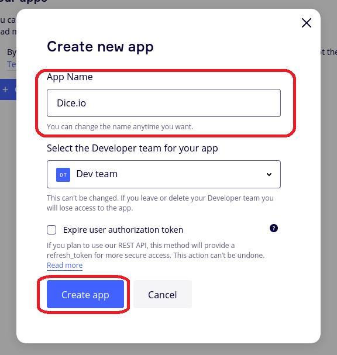
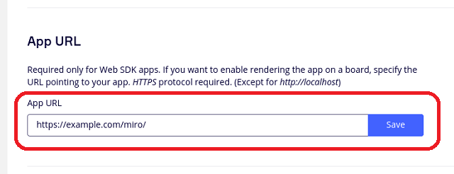
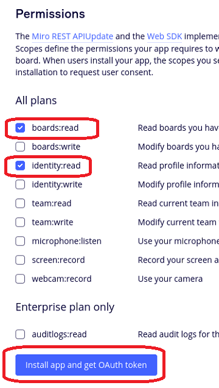
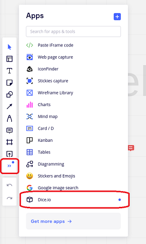

# Miro Web Plugin

This documentation assumes that :

* you host your own dice.io server on an https domain.
* you are logged in to [Miro](https://miro.com)

## Getting started

To get started you need to :

* Create __Dev team__ for Sandbox _(Allow to create application)_
* Create an application and set it up _(web-plugin url and scopes)_

### Create Dev Team

Note : you can skip this step if already have __Dev Team__.

Just follow [instructions here](https://developers.miro.com/docs/rest-api-build-your-first-hello-world-app#step-1-create-a-developer-team-in-miro). _(click on the __"Create a Developer team in Miro"__ link)_

### Create application

In Miro account __profile settings__, click on __"Your apps"__ tab and click on __"Create a new app"__ button (after checking box).

In __"Create new app"__ modal, enter App Name then click on __"Create app"__ button.

In __App URL__ section enter the dice.io server web plugin url : it is server root url __with `/miro/` path__, and click on __"save"__ button.

_(for example `https://example.com/miro/`)_

In __Permissions__ section select `boards:read` and `identity:read` scopes.

Finally, click on __"Install app and get OAuth Token"__ button and choose the team where to install the app.

Note: this web plugin does not access to boards, it only get :

* the id of current logged in user to setup the dice roller nickname
* the board id to setup the dice roller channel name _(shared by all users connected to the board)_

## Usage

When installed, the app is available by clicking the "more tools" button on the left side bar.

Just click on app button to open sidebar and type a dice formula.

## Credits

Dice SVG icon originally made by [Smashicons](https://smashicons.com/) from [www.flaticon.com](https://www.flaticon.com/).
